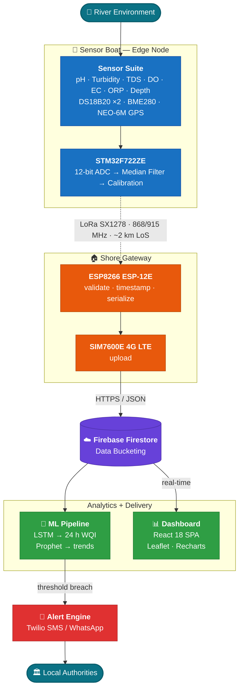
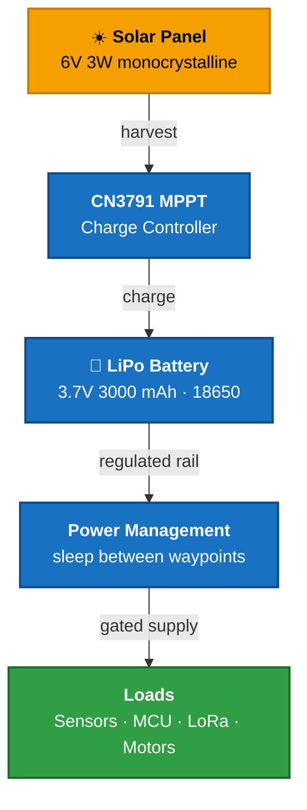
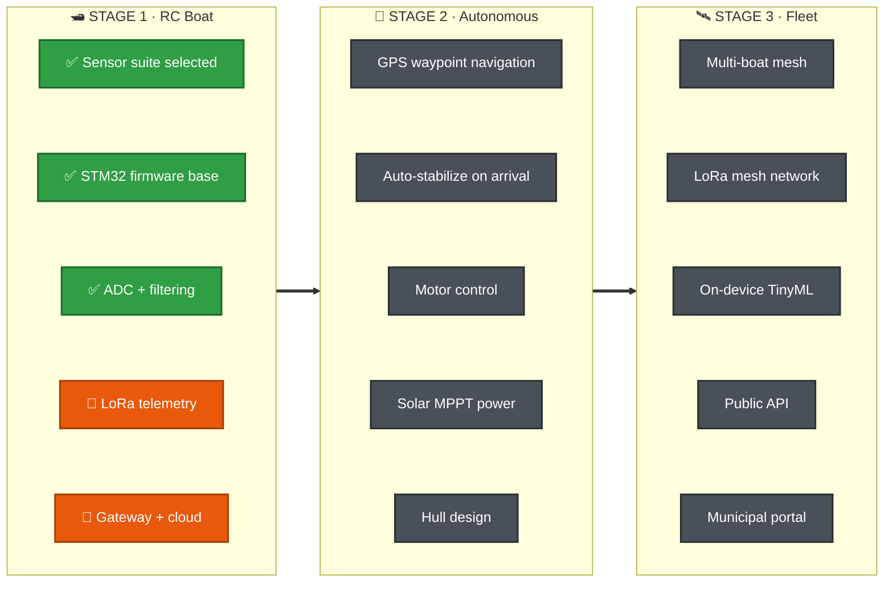

<div align="center">

<br>

# 🌊 WQM Project

### Real-Time River Water Quality Monitoring & Pollution Prediction

**A solar-powered sensor boat patrols Himalayan rivers, streams readings over LoRa,<br>and forecasts pollution 24 hours before it arrives.**

<br>

<p>
  
  
  
  
  
</p>

<p>
  <a href="https://github.com/WQM-Project/WQM"></a>
  <a href="https://github.com/WQM-Project/WQM/stargazers"></a>
  <a href="https://github.com/WQM-Project/WQM"></a>
</p>

<p>
  <a href="https://github.com/WQM-Project/WQM/blob/main/README.md"><b>📖 Full Spec</b></a> &nbsp;·&nbsp;
  <a href="https://github.com/WQM-Project/WQM/tree/main/Sensor_Readme"><b>📡 Hardware Docs</b></a> &nbsp;·&nbsp;
  <a href="https://github.com/WQM-Project/WQM/blob/main/Sensor_Readme/WQM_Sensor_BOM.md"><b>🧾 Bill of Materials</b></a>
</p>

<br>

</div>

---

## 🏔️ The Problem

The **Beas**, **Uhl**, and **Suketi** are losing ground to unmanaged construction runoff, tourism waste, and accelerated glacial melt.

The way we watch them hasn't kept up. Manual sampling catches one point in space and time. Lab turnaround takes days. Deep valleys have no Wi-Fi, patchy cellular, and no grid power for fixed stations.

**So pollution spikes get discovered after they've already moved downstream.**

## 🚀 Our Solution

An IoT boat that goes to the water instead of waiting for the water to reach a lab.

|  | |
|:-:|:--|
| 📡 | **Measures** 10 water-quality parameters with industrial-grade sensors, filtered and calibrated on the edge |
| 📶 | **Transmits** over LoRa — ~2 km line-of-sight to shore, then 4G LTE to the cloud |
| 🤖 | **Predicts** the Water Quality Index 24 hours ahead with an LSTM trained on CPCB data |
| 🚨 | **Alerts** authorities via SMS and WhatsApp the moment thresholds break |

---

## 🏗️ System Architecture



---

## 📡 Sensor Suite

| Sensor | Model | Parameter | Range | Interface |
|:-------|:------|:----------|:------|:----------|
| 🧪 pH | DFRobot SEN0161 | pH Level | 0–14 pH (±0.1) | Analog |
| 🌫️ Turbidity | DFRobot SEN0189 | Suspended Solids | 0–3000 NTU | Analog |
| 💧 TDS | DFRobot SEN0244 | Dissolved Solids | 0–1000 ppm | Analog |
| 🌡️ Temperature | DS18B20 ×2 | Water Temp | −55 to +125 °C (±0.5) | OneWire |
| 🫧 Dissolved O₂ | DFRobot SEN0237-A | DO Concentration | 0–20 mg/L | Analog |
| ⚡ Conductivity | DFRobot DFR0300 | EC (K=1) | 0–20 mS/cm | Analog |
| 🔋 ORP | DFRobot SEN0165 | Redox Potential | ±2000 mV | Analog |
| 📏 Depth | JSN-SR04T | Water Level | 20–600 cm | Trig/Echo |
| 🌤️ Environment | BME280 | Air Temp + Humidity + Pressure | — | I²C |
| 📍 Location | NEO-6M / M8N | GPS Coordinates | — | UART |

---

## 🛠️ Tech Stack

<table>
<tr>
<td align="center" valign="top" width="20%">

**Edge / Firmware**

`STM32F722ZE`
`STM32CubeIDE`
`HAL Drivers`
`FreeRTOS`

</td>
<td align="center" valign="top" width="20%">

**Communication**

`LoRa SX1278`
`SIM7600E 4G`
`ESP8266`
`AT Commands`

</td>
<td align="center" valign="top" width="20%">

**Cloud**

`Firebase`
`Firestore`
`Cloud Functions`
`Data Bucketing`

</td>
<td align="center" valign="top" width="20%">

**ML / Analytics**

`TensorFlow`
`Keras LSTM`
`FB Prophet`
`Python 3.10`

</td>
<td align="center" valign="top" width="20%">

**Frontend**

`React 18`
`Vite`
`Leaflet.js`
`Recharts`

</td>
</tr>
</table>

---

## 📊 Communication Protocol

```
┌─ LoRa Packet Format ────────────────────────────────────────────────────────────┐
│ node_id │ timestamp │ lat │ lon │  pH  │ turb │ TDS  │ temp │  DO  │ cond │ CRC │
│  1 B    │    4 B    │ 4 B │ 4 B │  2 B │  2 B │  2 B │  2 B │  2 B │  2 B │ 2 B │
└─────────────────────────────────────────────────────────────────────────────────┘

   Edge → Gateway    LoRa SX1278 @ 868/915 MHz    ~2 km LoS  ·  ~500 m NLoS
   Gateway → Cloud   4G LTE, HTTPS + JSON         low bandwidth (~1.5 GB/day)
```

## 🔋 Power Architecture



Entirely off-grid. Non-critical modules power down between waypoints.

---

## 🗺️ Roadmap



<div align="center">
<sub>✅ done · 🔄 in progress · ⬜ planned</sub>
</div>

> [!NOTE]
> **Hull design is open.** The mechanical platform for both boat stages is still under active development — hydrodynamic stability, a rigid probe mast, and battery volume for propulsion. This is a great place to jump in.

---

## 📦 Repositories

| Repository | Description | Status |
|:-----------|:------------|:-------|
| [**`WQM`**](https://github.com/WQM-Project/WQM) | Core firmware, sensor drivers, LoRa telemetry, and full project documentation | 🟢 Active |

---

## 🤝 Contributing

Firmware optimization, ML model improvements, dashboard features, or hull design ideas — all of it is welcome. Open an issue or send a PR on the [main repo](https://github.com/WQM-Project/WQM).

---

<div align="center">
<sub>Built with 💙 for Himalayan river conservation</sub>
<br>
<sub><b>Embedded Systems</b> · <b>IoT</b> · <b>AI/ML</b> · <b>Environmental Conservation</b> · <b>Health Tech</b></sub>
</div>
